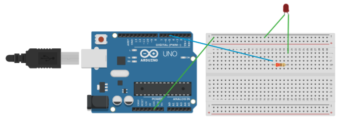

# Arduino Blink an external LED with Arduino UNO

## Description

This is my first arduino project.

In this project we control an extrenal LED through Arduino UNO.
The LED is cconnected through a 200Ω resistor on a breadboard and blinks every second.

## Components

- Arduino UNO
- Breadboard
- Jumper Wires
- LED
- USB cable
- 200Ω resistor

## Wirring

- Arduino digital pin 5 -> 200Ω resistor
- 200Ω resistor -> LED Anode (+)
- LED Cathode (-) -> GND

## Diagram

## Skills Learned

- Arduino IDE
- setup()
- loop()
- pinMode()
- digitalWrite()
- delay()
- Basic Breadboard Wiring
## Author

Nastoula Maria
